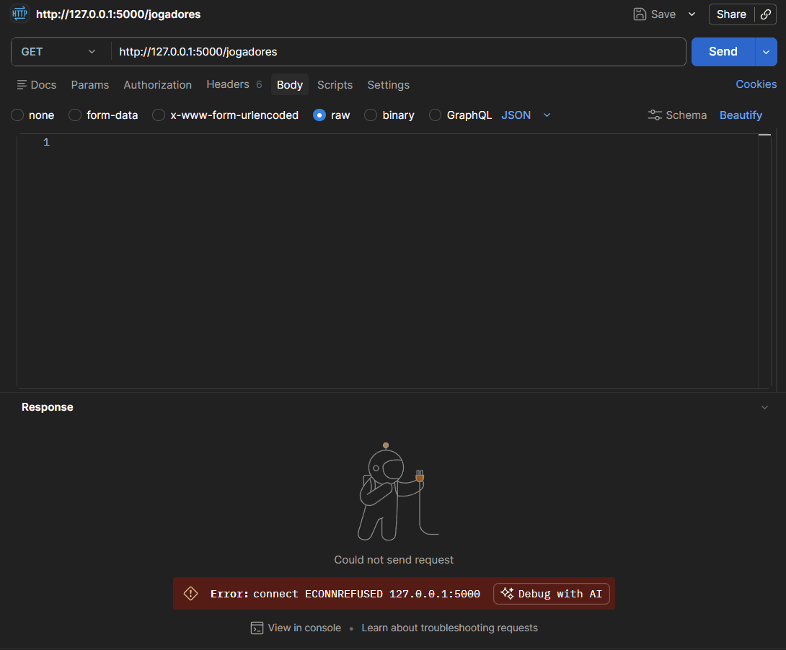
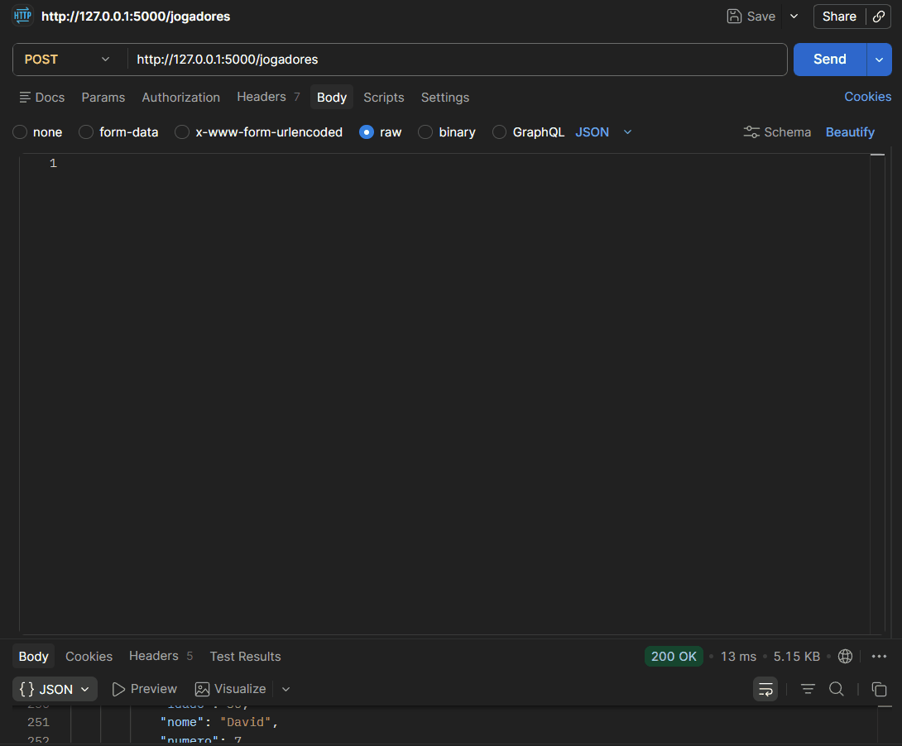
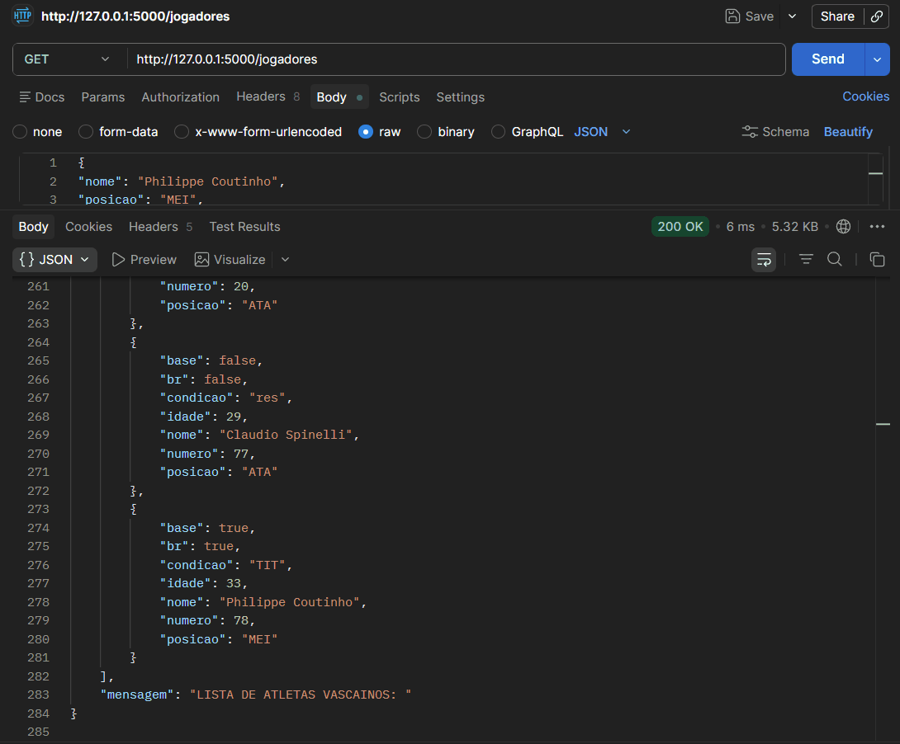

# API vascaína.


## Descrição:
API REST para gerenciamento do elenco do Clube de Regatas Vasco da Gama.

O programa permite:

- listar jogadores do elenco
- adicionar novos jogadores
- remover jogadores pela camisa

Projeto desenvolvido para o processo seletivo 2026.1 da empresa júnior CEOS, 
do curso de Ciência da Computação da Universidade Federal do Ceará (UFC).

### Tecnologias utilizadas

- Python
- Flask
- JSON
- Postman


## Instruções de uso:

### GET /jogadores
Retorna a lista completa de jogadores cadastrados.
EX: 
```json
{
"lista": [
{
"nome": "Pablo",
"posicao": "GOL",
"idade": 23,
"numero": 37,
"condicao": "n_rel",
"base": true,
"br": true
}
],
"mensagem": "LISTA DE ATLETAS VASCAÍNOS: "
}
```

### POST /jogadores
Adiciona um novo jogador à lista de atletas do plantel do Vasco.
EX - JSON:
```json
{
"nome": "Philippe Coutinho",
"posicao": "MEI",
"idade": 33,
"numero": 10,
"condicao": "TIT",
"base": true,
"br": true
}
```

### DELETE /jogadores/<numero>
EX: DELETE /jogadores/9
O comando do exemplo remove o jogador número 9, Matheus França, da lista 
do elenco do Vasco.


## Instruções de instalação:

### Passo 1 - Instalar o Python.
### Passo 2 - Instalar dependências com:
```bash
pip install -r requirements.txt
```
### Passo 3 - Rodar a API com:
```bash
python API_Vasco.py
```
### Passo 4 - A API irá rodar em:
```bash
http://127.0.0.1:5000
```


## Como utilizar:

- Navegador (GET)
- Postman

EX: GET -> http://127.0.0.1:5000/jogadores
POST e DELETE com o uso do Postman.


## Demonstrações no Postman:

### GET


### POST


### DELETE

